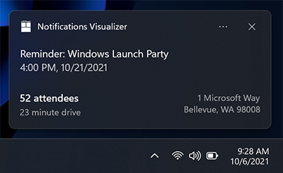

# Groups and Subgroups

Using Groups and Subgroups, developers gain extra control on how they organize text and images in their AppNotifications as shown in the bottom part of the AppNotification in the image below where the text is split into two columns, one of which is right aligned and some of the text is bolded.



The kind of fancy formatting shown in the above image can be achieved with the following xml, but it cannot be achieved using the AppNotificationBuilder at the moment.

```xml
<toast>
    <visual>
        <binding template='ToastGeneric'>
            <text>Reminder: Windows Launch Party</text>
            <text>4:00 PM, 10/21/2021</text>
            <group>
                <subgroup>
                    <text hint-style='base'>52 attendees</text>
                    <text hint-style='captionSubtle'>23 minute drive</text>
                </subgroup>
                <subgroup>
                    <text hint-style='captionSubtle' hint-align='right'>1 Microsoft Way</text>
                    <text hint-style='captionSubtle' hint-align='right'>Bellevue, WA 98008</text>
                </subgroup>
            </group>
        </binding>
    </visual>
</toast>
```

To support the Groups and Subgroups in the AppNotificationBuilder will require two new runtimeclasses: one for Groups and one for Subgroups.

The new AppNotificationGroup runtimeclass will simply be a container of Subgroups.

```idl
[contract(AppNotificationBuilderContract, 2)]
runtimeclass AppNotificationGroup
{
    AppNotificationGroup();

    Windows.Foundation.Collections.IVector<AppNotificationSubgroup> subgroups;

    AppNotificationGroup AddSubgroup(AppNotificationSubgroup subgroup);
};
```

The new AppNotificationSubgroup runtimeclass is where things really happen. The Subgroup class holds the texts and images to be organized and formatted according to the extended capabilities afforded by groups and subgroups.

```idl
[contract(AppNotificationBuilderContract, 2)]
runtimeclass AppNotificationSubgroup
{
        AppNotificationSubgroup();

        Boolean TextStacking;
        Int32 Weight;

        AppNotificationSubgroup SetTextStacking();
        AppNotificationSubgroup SetWeight(Int32 weight);

        // Adds text to the AppNotificationSubgroup.
        AppNotificationSubgroup AddText(String text);
        AppNotificationSubgroup AddText(String text, AppNotificationExtendedTextProperties properties);

        // Sets the image for the AppNotificationSubgroup.
        AppNotificationSubgroup SetImage(Windows.Foundation.Uri imageUri);
        AppNotificationSubgroup SetImage(Windows.Foundation.Uri imageUri, AppNotificationExtendedImageProperties properties);
};
```

AppNotificationTextProperties needs to be expanded to support the extended text formatting afforded by the groups and subgroups feature. The proposed additions (properties and methods) to the existing AppNotificationTextProperties runtimeclass are shown below (they are identified by a version 2 contract).

```idl
[contract(AppNotificationBuilderContract, 2)]
runtimeclass AppNotificationExtendedTextProperties : AppNotificationTextProperties
{
    AppNotificationExtendedTextProperties();

    AppNotificationTextStyle Style;
    Int32 MinLines;
    AppNotificationTextAlign Align;

    AppNotificationExtendedTextProperties SetStyle(AppNotificationTextStyle Style);
    AppNotificationExtendedTextProperties SetMinLines(Int32 value);
    AppNotificationExtendedTextProperties SetAlign(AppNotificationTextAlign Align);
};
```

Below is the enum to be used to specify the text style when calling the new SetStyle method from the AppNotificationTextProperties above.

```idl
[contract(AppNotificationBuilderContract, 2)]
enum AppNotificationTextStyle
{
    Default,
    Caption,
    CaptionSubtle,
    Body,
    BodySubtle,
    Base,
    BaseSubtle,
    Subtitle,
    SubtitleSubtle,
    Title,
    TitleSubtle,
    TitleNumeral,
    Subheader,
    SubheaderSubtle,
    SubheaderNumeral,
    Header,
    HeaderSubtle,
    HeaderNumeral,
};
```

And below is the enum to be used to specify the text style when calling the new SetAlign method from the AppNotificationTextProperties.

```idl
[contract(AppNotificationBuilderContract, 2)]
enum AppNotificationTextAlign
{
    Default,
    Auto,
    Left,
    Center,
    Right,
};
```

Contrary to images in an basic AppNotification, Images in subgroup support a wide range of options, which reuqires the introduction of a new ImageProperties call.

```idl
[contract(AppNotificationBuilderContract, 2)]
runtimeclass AppNotificationImageProperties
{
    AppNotificationImageProperties();

    Boolean ImageQuery;
    String AlternateText;
    AppNotificationImageCrop Crop

    AppNotificationImageProperties SetImageQuery();
    AppNotificationImageProperties SetAlternateText(String alternateText);
    AppNotificationImageProperties SetCrop(AppNotificationImageCrop crop);
};
```

```idl
[contract(AppNotificationBuilderContract, 2)]
runtimeclass AppNotificationExtendedImageProperties : AppNotificationImageProperties
{
    AppNotificationExtendedImageProperties();


    AppNotificationImageAlign Align;
    Boolean RemoveMargin;

    AppNotificationImageProperties SetAlign(AppNotificationImageAlign align);
    AppNotificationImageProperties SetRemoveMargin();
};
```

```idl
[contract(AppNotificationBuilderContract, 2)]
enum AppNotificationTextStacking
{
    Default,
    Top,
    Center,
    Bottom,
};
```

```idl
[contract(AppNotificationBuilderContract, 2)]
runtimeclass AppNotificationExtendedImageProperties : AppNotificationImageProperties
{
    AppNotificationExtendedImageProperties();

    AppNotificationImageAlign Align;
    Boolean RemoveMargin;

    AppNotificationImageProperties SetAlign(AppNotificationImageAlign align);
    AppNotificationImageProperties SetRemoveMargin();
};
```

```idl
[contract(AppNotificationBuilderContract, 2)]
enum AppNotificationTextStacking
{
    Default,
    Top,
    Center,
    Bottom,
};
```

ImageCrop in the AppNotificationImageProperties class above, uses the same enum for the Crop property that already exists for base AppNotifications. Sionce there are no equivalent support for Align in base AppNotifications, we're introducing our own here.

```idl
[contract(AppNotificationBuilderContract, 2)]
enum AppNotificationImageAlign
{
    Default,
    Left,
    Right,
    Stretch,
};
```

Finally, AppNotificationBuilder requires a new AddGroup method so that groups and their subgroups can be embedded into the final AppNotification.

```idl
[contract(AppNotificationBuilderContract, 1)]
runtimeclass AppNotificationBuilder
{
    ...

    // Sets the full-width inline-image that appears when you expand the AppNotification
    AppNotificationBuilder SetInlineImage(Windows.Foundation.Uri imageUri);
    [contract(AppNotificationBuilderContract, 2)]
    AppNotificationBuilder SetInlineImage(Windows.Foundation.Uri imageUri, AppNotificationImageProperties properties);
    [deprecated("Use the AppNotificationImageProperties version of this function instead of this one. For more info, see MSDN.", deprecate, AppNotificationBuilderContract, 2)]
    AppNotificationBuilder SetInlineImage(Windows.Foundation.Uri imageUri, AppNotificationImageCrop imageCrop);
    [deprecated("Use the AppNotificationImageProperties version of this function instead of this one. For more info, see MSDN.", deprecate, AppNotificationBuilderContract, 2)]
    AppNotificationBuilder SetInlineImage(Windows.Foundation.Uri imageUri, AppNotificationImageCrop imagecrop, String alternateText);

    // Sets the image that replaces the app logo
    AppNotificationBuilder SetAppLogoOverride(Windows.Foundation.Uri imageUri);
    [contract(AppNotificationBuilderContract, 2)]
    AppNotificationBuilder SetAppLogoOverride(Windows.Foundation.Uri imageUri, AppNotificationImageProperties properties);
    [deprecated("Use the AppNotificationImageProperties version of this function instead of this one. For more info, see MSDN.", deprecate, AppNotificationBuilderContract, 2)]
    AppNotificationBuilder SetAppLogoOverride(Windows.Foundation.Uri imageUri, AppNotificationImageCrop imageCrop);
    [deprecated("Use the AppNotificationImageProperties version of this function instead of this one. For more info, see MSDN.", deprecate, AppNotificationBuilderContract, 2)]
    AppNotificationBuilder SetAppLogoOverride(Windows.Foundation.Uri imageUri, AppNotificationImageCrop imageCrop, String alternateText);

    // Sets the image that displays within the banner of the AppNotification.
    AppNotificationBuilder SetHeroImage(Windows.Foundation.Uri imageUri);
    AppNotificationBuilder SetHeroImage(Windows.Foundation.Uri imageUri, String alternateText);

    ...

    [contract(AppNotificationBuilderContract, 2)]
    AppNotificationBuilder AddGroup(AppNotificationGroup value);

    ...
};
```

The following code snippet shows how the updated AppNotificationBuilder can be used to create the exact same AppNotification shown at the beginning of this document.

```c++
auto builder{ winrt::AppNotificationBuilder()
    .AddText(L"Reminder: Windows Launch Party")
    .AddText(L"4:00 PM, 10/21/2021")
    .AddGroup(winrt::AppNotificationGroup()
        .AddSubgroup(winrt::AppNotificationSubgroup()
            .AddText(L"52 attendees", winrt::AppNotificationTextProperties()
                .SetStyle(winrt::AppNotificationTextStyle::Base))
            .AddText(L"23 minute drive", winrt::AppNotificationTextProperties()
                .SetStyle(winrt::AppNotificationTextStyle::CaptionSubtle)))
        .AddSubgroup(winrt::AppNotificationSubgroup()
            .AddText(L"1 Microsoft Way", winrt::AppNotificationTextProperties()
                .SetStyle(winrt::AppNotificationTextStyle::CaptionSubtle)
                .SetAlign(winrt::AppNotificationTextAlign::Right))
            .AddText(L"Bellevue, WA 98008", winrt::AppNotificationTextProperties()
                .SetStyle(winrt::AppNotificationTextStyle::CaptionSubtle)
                .SetAlign(winrt::AppNotificationTextAlign::Right))))
};
```

# Additional Notes
* The new AddGroup method is very similar in name to the SetGroup method that already exists in the AppNotificationBuilder runtimeclass. It's unfortunate as this may be a source of confusion for developers.
* Contrary to most other runtime classes part of the Builder API, the Subgroup runtime class doesn't expose its properties. This is in-line with the AppNotificationBuilder class which also does not expose properties and in part because there currently isn't away to expose the Text strings along with their TextProperties that would make sense. If we created a struct to hold the text and their properties, we could easily expose them in the Subgroup class as well as in the AppNotificationBuilder class.
