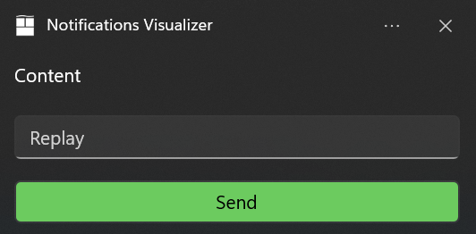
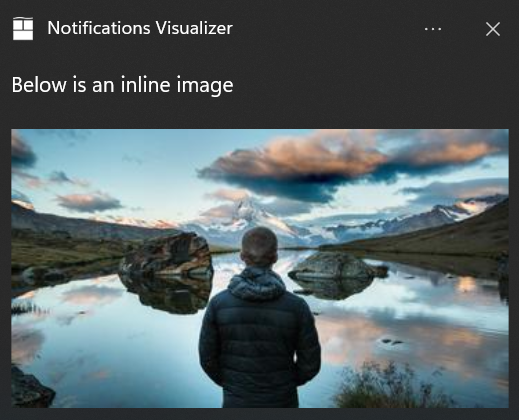
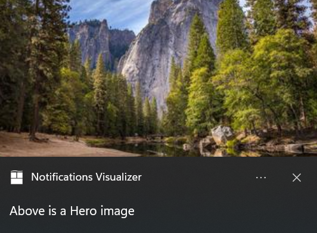

# App Notification Builder

# Background

App Notifications are UI popups that contain rich text, controls and images to display a message to
the user. With the Windows App SDK, developers can define an XML payload and display an
AppNotification using the AppNotificationManager::Show API, but defining these XML payloads can be
tedious when written by hand.

To generate an AppNotification like this one:


Developers have to write something like this:

```c++
int sequenceId {1234};
std::wstring pathToImage {LR"(path\to\my\image.png)"};

winrt::hstring xmlPayload{
    L"<toast launch = \"action=AppNotificationClick&amp;sequence=" + to_wstring(sequenceId) + L"\">\
        <visual>\
            <binding template = \"ToastGeneric\">\
                <image placement = \"appLogoOverride\" hint-crop=\"circle\" src = \"" + pathToImage + L"\"/>\
                <text>App Notification with Avatar Image</text>\
                <text>This is an example message using XML</text>\
            </binding>\
        </visual>\
        <actions>\
            <action\
                content = \"Open App\"\
                arguments = \"action=OpenApp&amp;sequence=" + to_wstring(sequenceId) + L"\"/>\
        </actions>\
    </toast>" };

auto toast{ winrt::AppNotification(xmlPayload) };
winrt::AppNotificationManager::Default().Show(toast);
```

# Description

To improve the AppNotification construction experience, the Windows App SDK is introducing
AppNotificationContent, a builder that constructs simple or rich App Notifications for the
developer.

```c++
AppNotificationContent()
    .AddArgument(L"AppNotificationClick")
    .AddArgument(L"sequence", 1234)
    .AddImage(Image(LR"(path\to\my\image.png)")
        .SetImagePlacement(ImagePlacement::AppLogoOverride)
        .SetUsesCircleCrop(true))
    .AddText(Text(L"App Notification with Avatar Image"))
    .AddText(Text(L"This is an example message"))
    .AddButton(Button(L"Open App")
        .AddArgument(L"action", "OpenAppButton")
        .AddArgument(L"sequence", sequenceId))
    .Show();
```

# API Components

**AppNotificationContent** The AppNotificationContent component sets up the xml for a <toast>. This
is the wrapper content that will include any component adding to the AppNotification UI.

Here is the <toast> schema: <toast launch? = string duration? = "long" | "short" displayTimeStamp? =
string scenario? = "reminder" | "alarm" | "incomingCall" | "urgent" useButtonStyle? = boolean>

  <!-- Child elements -->

visual, audio?, actions? </toast>

These attributes are abstracted away by the AppNotificationContent component APIs:

-   AddArgument(String key)
-   AddArgument(String key, T value)
-   SetDuration(enum Duration)
-   SetUseButtonStyle(Boolean usesButtonStyle)
-   SetTimeStamp(String timeStamp)
-   SetScenario(ScenarioType scenarioType)

All the below UI components are able to be appended through the AppNotificationContent component
APIs:

-   AddText(Text text)
-   AddButton(Button button)
-   AddImage(Image image)
-   AddAudio(Audio audio)
-   AddTextBox(TextBox textBox)
-   AddSelectionMenu(SelectionMenu selectionMenu)

Below is an example usage:

```c#
AppNotificationContent()
    .AddArgument(L"launch")
    .SetDuration(Duration::Long)
    .SetTimeStamp(L"2022-06-19T08:30:00Z")
    .SetScenarioType(ScenarioType::IncomingCall)
        .AddText(Text(L"Incoming Call")
            .SetIsCallScenario(true))
        .AddImage(Image(LR"(https://unsplash.it/100?image=883)")
            .SetUsesCropCircle(true))
        .AddButton(Button(L"Text Reply")
            .SetIconUri(LR"(Assets/Icons/message.png)")
            .AddArgument(L"action", L"textReply")
            .AddArgument(L"callId", 938163))
        .AddButton(Button(L"Reminder")
            .SetIconUri(LR"(Assets/Icons/reminder.png)")
            .AddArgument(L"action", L"reminder")
            .AddArgument(L"callId", 938163))
        .AddButton(Button(L"Ignore")
            .SetIconUri(LR"(Assets/Icons/cancel.png)")
            .AddArgument(L"action", L"ignore")
            .AddArgument(L"callId", 938163))
        .AddButton(Button(L"Answer")
            .SetIconUri(LR"(Assets/Icons/telephone.png)")
            .AddArgument(L"action", L"answer")
            .AddArgument(L"callId", 938163))
    .Show();
```


If the developer wants the XML payload to add more components, AppNotificationContent::GetXml will
return the current version of their AppNotificationContent in a string format.

AppNotificationContent also has a Show API that allows the developer to display an AppNotification
of what has been added so far to the AppNotificationContent.

**Text** The Text component sets up the xml for a <text> element. Developers can define the content,
language, and placement of the text on the AppNotification.

Here is the xml schema for <text>: <text lang? = string placement? = "attribution"
hint-callScenarioCenterAlign? = boolean />

These attributes are abstracted with the Text component APIs:

-   SetLanguage(String language)
-   SetIsAttributionText(Boolean isAttributionText)
-   SetIsCallScenario(Boolean isCallScenario)

Below are some example usages:

-   AppNotificationContent Example

```c#
AppNotificationContent()
    .AddText(Text(L"Content")
        .SetLanguage(L"en-US"))
    .AddText(Text(L"Attribution Text")
        .SetIsAttributionText(true))
    .Show();
```


Developers can use SetIsCallScenario(bool) to center the text like an incoming call. This feature
will be ignored unless the AppNotification scenario is set to IncomingCall using
AppNotificationContent::SetScenario(enum ScenarioType).

```c#
AppNotificationContent()
    .SetScenario(ScenarioType::IncomingCall)
    .AddText(Text(L"Content"))
        .SetIsCallScenario(true)
    .Show()
```


**Button** The Button component API sets up the xml for the <action> element. Buttons are
user-clickable components meant to start an action from the app.

Here is the <action> schema: <action content = string arguments = string placement? = "contextMenu"
imageUri? = string hint-inputid? = string hint-buttonStyle? = "success" | "critical" hint-toolTip? =
string />

These attributes are abstracted with the Button component APIs:

-   Button(String content)
-   AddArguments(String key)
-   AddArguments(String key, T value)
-   SetIconUri(String iconUri)
-   SetToolTip(String toolTip);
-   SetIsContextMenuPlacement(Boolean isContextMenuPlacement)
-   SetInputId(String inputId)

Below are some example usages:

```c#
AppNotificationContent()
    .AddText(Text(L"Content"))
    .AddTextBox(TextBox(L"textBox")
        .SetPlaceHolderContent(L"Reply"))
    .AddButton(Button(L"Send")
        .SetIconUri(LR"(Assets/Icons/send.png)")
        .AddArgument(L"action", L"textReply")
        .SetInputId(L"textBox"))
    .Show();
```


Developers can change the color of the button using SetButtonStyle(ButtonStyle). The two button
styles are ButtonStyle::Success (green) and ButtonStyle::Critical (red).
AppNotificationContent::SetUseButtonStyle(bool) must be set to true for the button to use the button
styles.

```c#
AppNotificationContent()
    .SetUseButtonStyle(true)
    .AddText(Text(L"Content"))
    .AddTextBox(TextBox(L"textBox")
        .SetPlaceHolderContent(L"Reply"))
    .AddButton(Button(L"Send")
        .AddArgument(L"action", L"textReply")
        .SetButtonStyle(ButtonStyle::Success))
    .Show();
```



The ToolTip is useful for buttons with icons and no content. Users can hover over the button with
the cursor and a text will display describing what the button does.

```c#
AppNotificationContent()
    .AddText(Text(L"Content"))
    .AddTextBox(TextBox(L"textBox")
        .SetPlaceHolderContent(L"Reply"))
    .AddButton(Button(L"Send")
       .AddArgument(L"action", L"textReply")
        .SetInputId(L"textBox")
        .SetToolTip(L"Send")
        .SetIconUri(LR"(Assets/Icons/message.png)"))
    Show();
```


The placement attribute defines action for a user to interact with when the AppNotification is
right-clicked. This would typically be used by developers to ask the user for setting changes.

```c#
AppNotificationContent().
    AddText(Text(L"Content")).
    AddTextBox(TextBox(L"textBox").
        SetPlaceHolderContent(L"Reply")).
    AddButton(Button(L"Send").
        SetInputId(L"textBox").
        SetIsContextMenuPlacement(true))
    .Show();
```


**Image** The Image component API sets up the xml for the <image> element. Images are visual
elements that are used to enhance an AppNotification.

The image source can be pulled using one of these protocol handlers:

-   http:// or https:// (A web-based image)
-   ms-appx:/// (An image included in the app package)
-   ms-appdata:///local/ (An image saved to local storage)
-   file:/// (A local image)

Here is the <image> schema: <image src = string alt? = string placement? = "appLogoOverride" |
"hero" hint-crop? = "circle" />

These attributes are abstracted with the Button component APIs:

-   Image(String imageSrc)
-   SetAlternateText(String alternateText)
-   SetImagePlacement(ImagePlacement placement)
-   SetUsesCircleCrop(Boolean usesCircleCrop)

Images can be displayed in three different ways:

-   Inline (A full-width inline-image that appears when you expand the AppNotification)

```c#
AppNotificationContent()
    .AddText(Text(L"Below is an inline image"))
    .AddImage(Image(LR"(https://unsplash.it/360/202?image=883)")
        .SetImagePlacement(ImagePlacement::Inline)
        .SetAlternateText(L"Image with nature"))
    .Show();
```



-   AppLogoOverride (overrides the AppNotification app logo with a custom image)

```c#
AppNotificationContent()
    .AddText(Text(L"To the left is an AppLogoOverride"))
    .AddImage(Image(LR"(https://unsplash.it/64?image=669)")
        .SetImagePlacement(ImagePlacement::AppLogoOverride)
        .SetAlternateText(L"Profile picture"))
    Show();
```


-   Hero (prominently displays image within the AppNotification banner and while inside Notification
    Center)

```c#
AppNotificationContent()
    .AddText(Text(L"Above is a Hero image"))
    .AddImage(Image(LR"(https://unsplash.it/360/180?image=1043)")
        .SetImagePlacement(ImagePlacement::Hero)
        .SetAlternateText(L"Image with nature"))
    .Show();
```



For both Inline and AppLogoOverride, developers can set how the image will be cropped with
SetUsesCircleCrop(bool).

-   Cropped AppLogoOverride

```c#
AppNotificationContent()
    .AddText(Text(L"To the left is an AppLogoOverride"))
    .AddImage(Image(LR"(https://unsplash.it/64?image=669)")
        .SetImagePlacement(ImagePlacement::AppLogoOverride)
        .SetUsesCircleCrop(true)
        .SetAlternateText(L"Profile picture"))
    .Show();
```


**Audio** The Audio component allows the developer to define a custom audio to play when an
AppNotification is displayed. The audio file can be defined by string value pointing to an app asset
or one of the
[ms-winsoundevents](https://docs.microsoft.com/en-us/uwp/schemas/tiles/toastschema/element-audio).

Here is the xml schema for <audio>: <audio src? = string loop? = boolean silent? = boolean />

These attributes are abstracted with the Audio component APIs:

-   SetAudioSrc(String audioSrc)
-   SetIsLooped(Boolean isLooped)
-   SetIsMuted(Boolean isMuted)

Below are some example usages:

```c#
AppNotificationContent()
    .AddAudio(Audio()
        .SetAudioSrc(L"ms-winsoundevent:Notification.Reminder"))
    Show();
```

Developers can define if the audio should be looped using SetIsLooped(bool). The duration of the
AppNotification must also be set using AppNotificationContent::AddDuration(enum Duration), which can
be short or long.

```c#
AppNotificationContent()
    .AddDuration(Duration::Long)
    .AddText(Text(L"Content"))
    .AddAudio(Audio()
        .SetAudioSrc(L"ms-winsoundevent:Notification.Looping.Alarm")
        .SetIsLooped(true))
    .Show();
```

An AppNotification that does not want to play any audio including the default, can use
SetIsMuted(bool) to mute the audio.

```c#
AppNotificationContent()
    .AddText(Text(L"Content"))
    .AddAudio(Audio()
        .SetIsMuted(true))
    .Show();
```

**TextBox** TextBox is an <input> component that allows users to type custom responses on an
AppNotification.

Here is the schema for input when type="text" <input id = string placeHolderContent? = string >
</input>

These attributes are abstracted with the TextBox component APIs:

-   TextBox(String id)
-   SetPlaceHolderContent(String placeHolderContent)

Below is an example use:

-   AppNotificationContent

```c#
AppNotificationContent()
    .AddTextBox(TextBox(L"textBox")
        .SetPlaceHolderContent(L"reply"))
    .AddButton(Button(L"Send").
        .SetInputId(L"textBox"))
    .Show();
```


**SelectionMenu** SelectionMenu is an <input> component that allows users to pick from a dropdown
menu of values on an AppNotification.

Here is the schema for input when type="selection" <input id = string defaultInput? = string >

<!-- Child elements --> selection{0,5} </input>

These attributes are abstracted with the SelectionMenu component APIs:

-   SelectionMenu(String id)
-   SetDefaultSelection(String id)
-   AddSelection(String id, String content)

Below is an example use:

-   AppNotificationContent

```c#
AppNotificationContent()
    .AddSelectionMenu(SelectionMenu(L"selectionMenu")
        .SetDefaultSelection(L"yes")
        .AddSelection(L"yes", L"Going")
        .AddSelection(L"maybe", L"Maybe")
        .AddSelection(L"no", L"Decline"))
    .AddButton(Button(L"Send")
        .SetInputId(L"selectionMenu"))
    .Show();
```


# API Details

```c#
namespace Microsoft.Windows.AppNotifications.Builder
{
    runtimeclass Text
    {
        Text(String content);

        String Content{ get; };
        Text SetContent(String content);

        // The target locale of the XML payload, specified as a BCP-47 language tags.
        String Language{ get; };
        Text SetLanguage(String language);

        // Center the text for incoming call notifications. This value is only used for notifications with with a scenario value of IncomingCall.
        Boolean IsCallScenario { get; };
        Text SetIsCallScenario(Boolean isCallScenario);

        // Displays text at the bottom of your notification, along with your app's identity or the notification's timestamp.
        // On older versions of Windows that don't support attribution text, the text will simply be displayed as another text element.
        Boolean IsAttributionText { get; };
        Text SetIsAttributionText(Boolean isAttributionText);

        // Retrieves the XML content of the Text.
        String GetXml();
    }

    enum ButtonStyle
    {
        Success, // The button will be green
        Critical, // The button will be red
    }

    runtimeclass Button
    {
        Button();
        Button(String content);

        // Get/Sets the text to display on the button.
        String Content{ get; };
        Button SetContent(String content);

        // Gets app-defined string of arguments that the app can later retrieve once it is activated when the user clicks the button.
        String Arguments { get; };

        // Gets/sets the Icon source for the button.
        String IconUri { get; };
        Button SetIconUri(String iconUri);

        // The tooltip for a button, if the button has an empty content string.
        String ToolTip { get; };
        Button SetToolTip(String toolTip);

        // Sets if the Button will be a context menu action.
        Boolean IsContextMenuPlacement { get; };
        Button SetIsContextMenuPlacement(Boolean isContextMenuPlacement);

        ButtonStyle ButtonStyle { get;};
        Button SetButtonStyle(ButtonStyle buttonStyle);

        // Gets or sets the ID of an existing AppNotificationTextBox in order to have this button display to the right of the input.
        String InputId{ get; };
        Button SetInputId(String inputId);

        // Adds a key(without value) to the activation arguments that will be returned when the toast notification or its buttons are clicked.
        Button AddArgument(String key);

        // Adds a key/value to the activation arguments that will be returned when the toast notification or its buttons are clicked.
        [default_overload]
        Button AddArgument(String key, String value);
        Button AddArgument(String key, Int32 value);
        Button AddArgument(String key, Double value);
        Button AddArgument(String key, Single value);
        Button AddArgument(String key, Boolean value);

        // Retrieves the XML content of the button.
        String GetXml();
    }

    runtimeclass TextBox
    {
        TextBox(String id);

        // Gets the ID of the TextBox
        String Id { get; };

        // The placeholder displayed for text input.
        String PlaceHolderContent { get; };
        TextBox SetPlaceHolderContent(String placeHolderContent);

        // Retrieves the XML content of the input.
        String GetXml();
    }

    runtimeclass SelectionMenu
    {
        SelectionMenu(String id);

        // Gets the ID of the SelectionMenu
        String Id { get; };

        // Add a selection item to the SelectionMenu if InputType is SelectionMenu. The id parameter is used to retrieve the user input when the app is activated
        // and content is the displayed text for the item.
        SelectionMenu AddSelection(String id, String content);

        // Sets the default selection to be displayed by the SelectionMenu
        SelectionMenu SetDefaultSelection(String id);

        // Retrieves the XML content of the input.
        String GetXml();
    }

    runtimeclass Audio
    {
        Audio();

        // Get/Set the audio source for the AppNotification.
        String AudioSrc { get;};
        Audio SetAudioSrc(String audioSrc);

        // Duration must also be set to define the loop length.
        Boolean IsLooped { get; };
        Audio SetIsLooped(Boolean isLooped);

        Boolean IsMuted { get; };
        Audio SetIsMuted(Boolean isMuted);

        // Retrieves the XML content of the audio.
        String GetXml();
    }

    enum ImagePlacement
    {
        Inline, // A full-width inline-image that appears when you expand the AppNotification.
        AppLogoOverride, // Overrides the AppNotification app logo with a custom image.
        Hero, // Prominently displays image within the AppNotification banner and while inside Notification Center.
    };

    runtimeclass Image
    {
        Image(String imageSrc);

        String ImageSrc { get; };

        // A description of the image, for users of assistive technologies.
        String AlternateText{ get; };
        Image SetAlternateText(String alternateText);

        // An enum to describe how the image will be cropped.
        Boolean UsesCircleCrop{ get; };
        Image SetUsesCircleCrop(Boolean usesCircleCrop);

        // Override the app logo with custom image of choice that will be displayed on the AppNotification, otherwise it will be an inline image.
        ImagePlacement Placement{ get; };
        Image SetImagePlacement(ImagePlacement placement);

        // Retrieves the XML content of the image.
        String GetXml();
    }

    enum ScenarioType
    {
        Default, // The normal Toast behavior. The AppNotification appears for a short duration, and then automatically dismisses into Notification Center.
        Reminder, // The notification will stay on screen until the user dismisses it or takes action.
        Alarm,    // Alarms behave like Reminder, but alarms will additionally loop audio with a default alarm sound.
        IncomingCall, // Incoming call notifications are displayed pre-expanded in a special call format and stay on the user's screen till dismissed.
        Urgent, // Important notifications allow users to have more control over what 1st party and 3rd party apps can send them high-priority AppNotifications (urgent/important) that can break through Focus Assist.
    }

    enum Duration
    {
        Short, // Default value. Toast appears for a short while and then goes into Notification Center.
        Long, // Toast stays on-screen for longer, and then goes into Notification Center.
    }

    runtimeclass AppNotificationContent
    {
        AppNotificationContent();

        // Adds a key(without value) to the activation arguments that will be returned when the toast notification or its buttons are clicked.
        AppNotificationContent AddArgument(String key);

        // Adds a key/value to the activation arguments that will be returned when the toast notification or its buttons are clicked.
        [default_overload]
        AppNotificationContent AddArgument(String key, String value);
        AppNotificationContent AddArgument(String key, Boolean value);
        AppNotificationContent AddArgument(String key, Int32 value);
        AppNotificationContent AddArgument(String key, Double value);
        AppNotificationContent AddArgument(String key, Single value);

        // Defines the amount of time the toast should display.
        AppNotificationContent SetDuration(Duration duration);

        // Allows Buttons using SetButtonStyle to display "success" | "critical" styles
        AppNotificationContent SetUseButtonStyle(Boolean usesButtonStyle);

        // Sets the scenario of the AppNotification.
        AppNotificationContent SetScenario(ScenarioType scenarioType);

        // Adds text to the AppNotification with a Text component.
        AppNotificationContent AddText(Text text);

        // Adds a button to the AppNotificationContent
        AppNotificationContent AddButton(Button button);

        // Add an image to the AppNotificationContent.
        AppNotificationContent AddImage(Image image);

        // Add an audio to play when the AppNotification is displayed.
        AppNotificationContent AddAudio(Audio audio);

        // Add an input TextBox to retrieve user input.
        AppNotificationContent AddTextBox(TextBox textBox);

        // Add an input SelectionMenu to retrieve user input.
        AppNotificationContent AddSelectionMenu(SelectionMenu selectionMenu);

        // Retrieves the notification XML content so that it can be used with a local
        // AppNotification constructor.
        String GetXml();

        // Shows a new AppNotification with the current content.
        void Show();
    }
}
```
