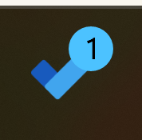

# Badge notifications in Windows App SDK

- [1. Background](#background)
- [2. Limitations of the Windows SDK APIs](#limitations-of-the-windows-sdk-apis)
- [3. API proposal](#api-proposal)
- [4. Remarks](#remarks)
- [5. IDL details](#idl-details)

## Background

Badges are a type of notifications indicating a summary or status information specific to an app. It is represented either by a number or a glyph sitting over the top-right corner of the taskbar app icon.

Here is an example of a numeric badge posted by Microsoft To-Do List:



Another example of a badge, in this case featuring a new message glyph posted by Outlook:


## Limitations of the Windows SDK APIs

Badge notification Windows SDK APIs have three main limitations:

- They don't support Win32 unpackaged apps.

- The Badge Windows SDK APIs expect an XML payload that contains the information about the badge to pin, even though the XML is a single line of content. There are no APIs where developers can directly send the number or specify the glyph type.

- As of today, Badge APIs support a limited set of glyphs. If the app doesn't find any suitable glyph to convey their status, there is no option to pin a custom overlay.

More information about Windows SDK Badge API usage can be found [here](https://learn.microsoft.com/en-us/windows/apps/design/shell/tiles-and-notifications/badges#create-a-badge).

## API proposal

As part of bringing badges into Windows App SDK, we propose addressing the issues explained the previous section. With this proposal, developers will be able to pin and clear badges writing less code than what is required in the Windows SDK.

It's worth mentioning this proposal covers local badge notifications. Cloud badges are out of the proposal scope.

### 1. Posting a numeric badge

```cpp
BadgeNotificationManager::ShowNumber(4);
```

Posting a badge will require a single line of code, instead of 5-6 lines that developers must write using the Windows SDK APIs.

Notes:

- Developers won't be able to post a badge with the value as negative or zero. The API will throw for the latter.

- If the specified number is greater than 99, a **99+** text will be rendered.

### 2. Posting a glyph badge

We will provide an enum that contains all glpyhs already supported in the Windows SDK. This enum will be named `BadgeNotificationGlyph`.

```cpp
BadgeNotificationManager::ShowGlyph(BadgeNotificationGlyph::Busy);
```

For a complete list of predefined glyphs, see the [IDL details section](#idl-details).

### 3. Posting a custom overlay

```cpp
// using winrt::Windows::Foundation;

std::wstring iconFilepath{ std::filesystem::current_path() / "MyCustomBadge.png" };
BadgeNotificationManager::ShowCustom(Uri{iconFilepath});
```

Notes:

- The URI is expected to be a full path, under the process path folder.
- Packaged apps will have the option to pass a ms-appx URI.
- Only local file paths will be supported.
- Tentative supported file formats: .ico, .png, .bmp, .jpg.

### 4. Clear a badge

```cpp
BadgeNotificationManager::Clear();
```

## Remarks

- **Badge replacement:** Any subsequent `BadgeNotificationManager::Show*` API call will replace any previous badge, if applicable.

- **Badge lifetime:** Badges will be tied to the lifetime of the app window for all apps. If the app is closed, the badge will be cleared. This behavior is managed by the Taskbar. In the Windows SDK, the Taskbar is able to persist packaged app badges beyond window lifetime. The implementation will call `ITaskbarList3::SetOverlayIcon(HWND, HICON, LPCWSTR description)` to post the badge. [Click here to check the SetOverlayIcon API doc](https://learn.microsoft.com/en-us/windows/win32/api/shobjidl_core/nf-shobjidl_core-itaskbarlist3-setoverlayicon).

- **Background support:** Background badge updates won't be supported at this point.

## IDL details

``` idl
namespace Microsoft.Windows.AppNotifications.Badges
{
    [contractversion(1)]
    apicontract BadgeNotificationsContract {}

    // The following glyphs are based on what's currently available in the Windows SDK:
    // https://learn.microsoft.com/en-us/windows/apps/design/shell/tiles-and-notifications/badges
    [contract(BadgeNotificationsContract, 1)]
    enum BadgeNotificationGlyph
    {
        Activity,
        Alarm,
        Alert,
        Attention,
        Available,
        Away,
        Busy,
        Error,
        NewMessage,
        Paused,
        Playing,
        Unavailable
    };

    [contract(BadgeNotificationsContract, 1)]
    static runtimeclass BadgeNotificationManager
    {
        static void ShowNumber(UInt32 number);

        static void ShowGlyph(BadgeNotificationGlyph glyph);

        static void ShowCustom(Windows.Foundation.Uri customBadgeUri);

        static void Clear();
    }
}
```

Notes:

- I considered having a Badge object to have a single `Show(Badge)` function. However, such Badge object would not expose any property, so I opted to have multiple `Show*` overloads instead.
